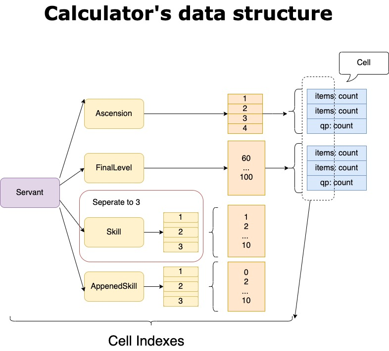

此文档为设计文档兼少部分数据结构的 Overview，并非详细的程序结构文档。

## 名词解释

Servant：从者

Item：素材，包括了
 - Material 一般素材
 - Stones 技能石
 - Chess 棋子

## 前端路由
此项目为为单页面应用，路由使用的是 react-router-dom 相应组件。

各 URL 对应组件如下：
- `/servants` 点击顶部导航，渲染 Servant 侧边栏。对于手机端，添加类为 Current Page，而不重新渲染。
- `/servants/:id` 从者详情页面
- `/items` 点击顶部导航，渲染 Item 侧边栏。
- `/items/:type` 某一类 Item 的页面。
	- type 的取值暂无变量定义，为手动编写的"materials""stones"和"chess"
- `/statistic`  渲染材料统计页面。

路由的变量定义在了 App.tsx 中的 `Pages` 里，以后有必要再做拆分。

## 数据库

数据库的作用是持久化存储计算所需的**游戏数据**与**用户数据**。（待实现）之后可以配合 Service Worker 以离线使用。

数据库使用浏览器内置的 IndexedDB，使用 dexie 的 api 进行操作，此 API 为 Promise 风格的调用，提供了类似 SQL 的调用方式，简化了原有 IndexedDB API 的复杂度与可读性。

### 初始化

数据库的初始化需要一个约 8M 的压缩后的 json 数据文件，此数据文件需要放置于 web 服务器上。

在页面启动时，会对当前数据库的状态进行判断。当初次使用时，会从远程下载文件， 解压后为json，处理后存入本地数据库。此后不会再次下载。

但图片类信息数据量过大，仍然依赖于远程的WebServer。（待实现）部署时可以通过配置，选择将图片放在与 Web App 同一个服务器上，或部署在另外的服务器上。注意图片的 API 需要支持跨域。

### 表(Object Store)结构

从远程下载的数据文件存入 indexDB 遵循以下的结构。

| Table Name   | Property(Primary Key)            | Property(Key)     | Property(Key)              | Property                                             | Property       |
| ------------ | -------------------------------- | ----------------- | -------------------------- | ---------------------------------------------------- | -------------- |
| servants     | id(Primary Key): number          | name(Key): string |                            | detail: object                                       |                |
| items        | id(Primary Key): number          | name(Key): string | category(Key): ItemType    | detail: object                                       |                |
| user_setting | id(Primary Key): number          | name(Key): string | type(Key): UserSettingType | setting: ServantSetting \| ItemSetting \| number(QP) |                |
| srcinfo      | dataversion(Primary Key): string |                   |                            |                                                      |                |
| calculator   | cellType                         | servantId: number | itemName: string           | itemNum: number                                      | qpCost: number |

上表中的自定义类型均在 db.ts中定义为 type 或 enum。其中的`UserSettingType`除了有 Servant 和 Item，还有一个 QP，为纯数字。

用户的数值设定`setting`为联合类型。`UserSettingType` 本应当约束 setting 的类型。但indexed数据库无法进行类型约束，只能在 CURD 时手动检查一遍类型。 

组件渲染时所需要的数据结构定义于组件所在的文件，且和数据库中的并不一致，因此需要一些数据结构转换的方法，在 db.ts 文件中以`map`开头。

### 设计时的一些问题

我在设计数据库结构时时并未对字段进行拆分。主要是因为从者的数据结构（servant detail 的结构）层级过多，光是结构定义就能写一个文件，如果源数据结构稍一修改就需要修改整个定义，不利于数据库的维护。

如果需要什么字段，访问其 detail 对象即可。 精力有限，detail 对象目前未写定义（需要写一整页），其结构需要看远程的 json 文件，或打开 inspector 查看。

再者 indexed 是 K-V 数据库，意味着更新数据时，无法直接更新 Value 中的一个 property，只能将整个 Value 取出，写入时也必须将整个 Value 写入。因此对于 usersetting 我不得不单独放置一个表，而不是在 servants 中增加 setting 字段。否则每次更新数据时都需要查询一次 Value，全部取出后更新数据、再插入，十分麻烦。

当然单独放置 user_setting 表的也有问题。组件渲染时通常都同时需要 setting 和 servants 两张表的数据。Indexed DB 查询两张表来得也比一张表复杂。每增加一个组件，就需要增加一个`map`方法。

总体来说，K-V 数据库在复杂的操作上限制还是很大，并不是很适用于此项目的场景。但 Web App 大量数据的储存方案并不多，目前并没有别的方法。

##  计算器

为了响应速度和计算速度，使用一个全局的 state 保存计算器实时信息，中心化修改，可以用 Redux。

修改一次每次都从 IndexedDB 取出数据渲染展示，好像也是可以的。CPU 换内存。但是要写的CRUD变多了。

### 数据结构

计算器为高维统计，每个 cell 以对象结构存储

```json
{
  servantId: number
  cellType: cellType
  cellTargetLevel: number
  itemName: string,
  itemNum: number
}
```

以上 cell 数成数组。不加 key 索引的原因在于，有时候要以 servant 为索引，有时候要以 itemName 为索引。倒是和 indexedDB 的索引不谋而合。所以可以用 indexedDB 存计算器的中间值，顺便加上事务。



最终的展示结果结构。以材料分类为起点

``` json
{
"铜素材":
    {
      "素材名":{
        id:
        name:
        needed:
        count:
        servants:
          [
            {
              id:
              name:
              icon:
              needed:
            },
            {...}
          ],
      }
    },
  "银素材":[..]
  {...}
  }
```
计算结果不打算存入数据库(看花费的时间)，要持久化可能又要多做一大堆的工作……但也不一定，让 Reducer 监听一下全局的 state 就好了。

由于这回三个表都要查找，手动编写 Transaction

### 导入导出

To be continued...

# UI交互细节

## 进度条

对于 JS，计算是十分耗时的工作。在 UI 上应当有适当的反馈。需要加进度条的地方有

- 下载远程文本数据时
- 计算时

## 手动数据录入

对于从者，提供一键满破操作。这部分的代码逻辑需要思考， 因为一个从者可设置的字段有 14 个，如果写多个  HandleClickPut 方法，很繁琐。如果监听 state 后统一 put，又很容易出现UI数据与数据库数据不一致的问题（而且还不是要写多个 HandleClickPut 的方法）

- [x] 对于素材使用回车自动 focus 以连续设定。
- [x] 数字输入框需要做格式化检查。